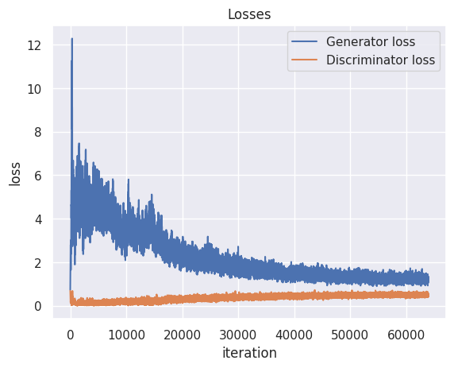

# Generating MNIST digits using Conditional GAN

This is a simple implementation of Conditional Generative Adversarial Networks (GAN) for generating MNIST digits.

I use simple BCE loss function for calculating the loss and Adam optimizer (lr=0.0001) for training.

## Architecture

- The **generator** is series of Linear layers with BatchNorm and ReLU activations.
- The **discriminator** is a series of Linear layers with BatchNorm andLeakyReLU activations.
- The Conditioning class is appended to the noise vector as a one-hot vector.

## Huggingface Space

You can try generating digits using this model on Huggingface Space.
https://huggingface.co/spaces/gholamreza/Conditional-GAN-MNIST

## Training History

Visit https://github.com/gholamrezadar/GAN-MNIST for a simpler version of this code and more details.